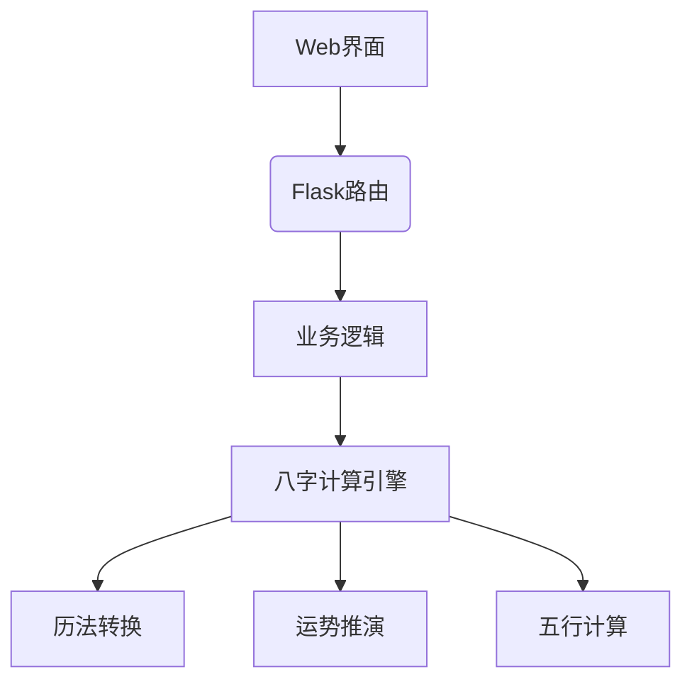
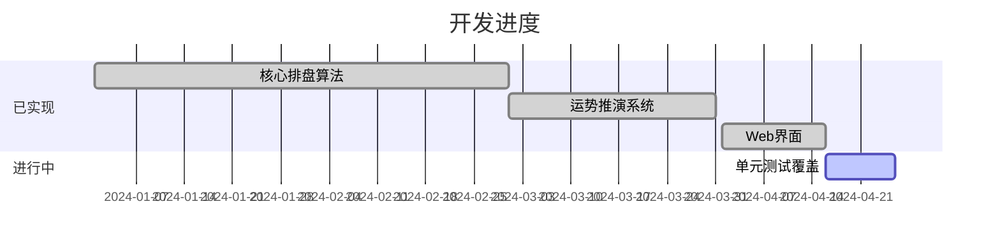

# 八字排盘系统 🎴


## 📖 项目简介
基于Flask框架的八字排盘系统，实现以下核心功能：
- 公历/农历双向精确转换（基于lunar_python库）
- 真太阳时自动校正
- 完整八字命盘生成（天干地支、五行、藏干）
- 大运/小运推演计算
- 生肖与虚岁计算

## 📚 文档导航
- [用户手册](docs/USER_GUIDE.md) - 系统使用说明
- [开发指南](docs/DEVELOPMENT.md) - 项目开发说明
- [贡献指南](docs/CONTRIBUTING.md) - 协作开发规范

## 🏗️ 系统架构


## 🧮 核心实现
### 1. 八字计算引擎（utils/bazi_calculator.py）
```python
class BaziCalculator:
    # 天干地支五行映射体系
    TIANGAN_WUXING = {'甲': '木', '乙': '木', ...}
    DIZHI_WUXING = {'子': '水', '丑': '土', ...}
    
    @classmethod
    def get_bazi_and_luck_info(cls, birth_params):
        """核心计算方法，返回：
        - 完整八字信息（含天干地支五行属性）
        - 大运列表（每十年运势）
        - 小运列表（逐年运势）
        - 生肖信息
        """
```

### 2. 历法转换特性
- 支持公元前722年至公元2100年的精确转换
- 自动处理闰月问题
- 时辰划分算法（每两小时为一个时辰）

## 🛠️ 安装指南
```bash
# 克隆仓库
git clone https://github.com/lichengguang/fate_web.git
cd fate_web

# 初始化环境
python -m venv venv
source venv/bin/activate
pip install -r requirements.txt
```

## 🚀 技术特性
| 模块 | 实现方案 | 数据精度 |
|------|----------|----------|
| 八字排盘 | lunar_python库 | 历法误差<1秒 |
| 五行计算 | 静态映射表 | 100%准确 |
| 大运推演 | 传统十年一运 | 符合子平法 |
| 农历转换 | 紫金山天文台算法 | 公元前722-公元2100 |

## 📈 功能进展


## 🤝 贡献指南
欢迎通过以下方式参与：
1. 补充单元测试用例
2. 完善日期验证逻辑
3. 优化运势推演算法
4. 增加异常处理场景

## 📜 许可证
[MIT License](LICENSE)
